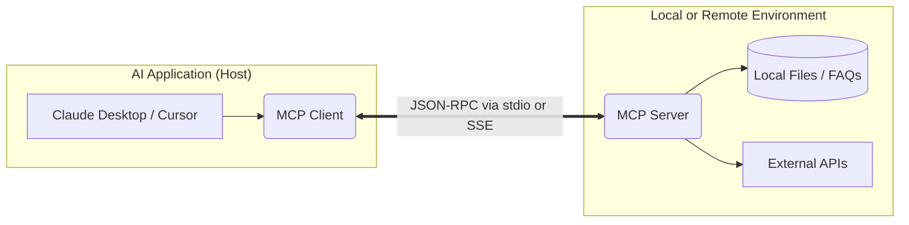

# Lab Manual: Mastering the Model Context Protocol (MCP)

**Course**: Deep Learning and Large Language Models  
**Semester**: 6th Semester Undergraduate  
**Instructor**: Dr. Moazam  

---

## 🎯 Lab Objectives
By the end of this lab, you will be able to:
1. Understand the theoretical foundations of the Model Context Protocol (MCP) and why it solves the $N \times M$ integration problem in AI.
2. Differentiate between the three MCP primitives: **Resources** (app-controlled), **Tools** (model-controlled), and **Prompts** (user-controlled).
3. Develop a functional MCP server using Python and the `FastMCP` framework.
4. Integrate your custom MCP server with an AI client (like Claude Desktop or Cursor).

---

## Part 1: Theoretical Framework

### 1.1 The Integration Problem
In the early days of AI agents, connecting an LLM to external services required custom integrations. Connecting 5 different LLMs (Claude, OpenAI, Gemini, etc.) to 5 different data sources (GitHub, Slack, local files, databases) required $5 \times 5 = 25$ custom API integrations. This is known as the **$N \times M$ integration problem**.

### 1.2 What is MCP?
Introduced by Anthropic, the **Model Context Protocol (MCP)** acts as the "USB-C of AI Agents". It is an open standard that allows developers to write an integration **once**, and any MCP-compatible AI client can immediately use it to access data and perform actions securely. 

### 1.3 Architecture Overview
MCP uses a client-server architecture.



- **Host/Client**: The AI application you interact with (e.g., Claude Code, Cursor).
- **Server**: The software you build to expose specific data and tools to the AI.
- **Transport Layer**: How they communicate. MCP supports **stdio** (standard input/output for local servers) and **SSE** (Server-Sent Events for remote servers).

---

## Part 2: The Three Primitives of MCP

MCP organizes capabilities into three categories. Understanding when to use which is the key to building secure and effective agents.

### 2.1 Resources (The App-Controlled Primitive)
Resources are pre-authorized data that the application exposes. The model **does not** decide what to expose; it simply reads what is available.
*   **Analogy**: File cabinets your application unlocks.
*   **Use Cases**: Reading documents, fetching configuration files, checking logs.

### 2.2 Tools (The Model-Controlled Primitive)
Tools are functions the LLM decides to execute based on the user's prompt. They represent actions and can have side effects.
*   **Analogy**: Buttons the agent can press.
*   **Use Cases**: Creating a GitHub issue, sending an email, deleting a file.

### 2.3 Prompts (The User-Controlled Primitive)
Prompts are predefined, parameterized templates that users can invoke via slash commands.
*   **Analogy**: Macros or shortcuts for common tasks.
*   **Use Cases**: Standardizing workflows, providing specialized context automatically.

---

## Part 3: Step-by-Step Lab Execution

### 3.1 Use Case: AI Lecture Assistant using MCP

> [!IMPORTANT]
> **The Core Usecase**
> This lab demonstrates an **AI Lecture Assistant** using MCP. The system connects an LLM with external tools to retrieve YouTube lecture transcripts and convert them into summaries, notes, quizzes, and topic outlines. Additional bonus tools such as GPA calculation can also be integrated. The lab highlights how MCP enables standardized interaction between AI models and educational services.

**Main Features:**
- Retrieve YouTube transcript
- Summarize lecture
- Generate notes
- Create quizzes
- Extract topics

**Bonus Features:**
- GPA / CGPA calculator
- Attendance predictor
- Deadline reminder
- Final Academic Summary (Optimized)

### 3.2 Prerequisites
Before starting the lab, ensure you have:
- **Python 3.10** or higher.
- **Node.js & npm** (required to run the MCP Inspector for debugging).
- A modern code editor like **VS Code** or **Cursor**.

### Step 1: Environment Setup
Open your terminal, navigate to your newly created project directory, and install the required libraries:

```bash
pip install mcp fastmcp pydantic
```
*(Note: Use this command if the `fastmcp` package is required separately in your environment.)*

### Step 2: Creating the Server Code
Create a file named `academic_server.py`. We will implement all our Main Features and Bonus Features using `FastMCP`. 

Copy the following server code:

```python
from mcp.server.fastmcp import FastMCP
from pydantic import Field
import json

# Initialize the server
mcp = FastMCP("AILectureAssistant")

# ==========================================
# RESOURCES
# ==========================================
COURSE_PLAYLISTS = {
    "cs224n_nlp": "Stanford CS224N: Natural Language Processing with Deep Learning.",
    "cs224r_rl": "Stanford CS224R: Deep Reinforcement Learning."
}

@mcp.resource("course://stanford/playlists", name="Stanford Course Playlists")
def list_playlists() -> str:
    """Returns the available course playlists."""
    return json.dumps(COURSE_PLAYLISTS)

# ==========================================
# MAIN FEATURES
# ==========================================
@mcp.tool(name="get_youtube_transcript", description="Retrieve the text transcript of a specific video lecture.")
def get_youtube_transcript(video_id: str = Field(description="The YouTube Video ID (e.g., DzpHeXVSC5I)")) -> str:
    """Simulates fetching a transcript for a given video ID."""
    transcripts = {
        "DzpHeXVSC5I": "Welcome to CS224N, Lecture 1. Today we will discuss Word Vectors. The core concept is representing words as dense, continuous vectors in a high-dimensional space so that words with similar meanings have similar vector representations. This revolutionized NLP..."
    }
    return transcripts.get(video_id, f"Error: Transcript not found for video ID {video_id}.")

@mcp.tool(name="extract_topics", description="Extracts the top core topics from a given text block.")
def extract_topics(text_block: str) -> str:
    """Simulates topic extraction logic."""
    return "Extracted Topics: 1. Word Vectors, 2. High-dimensional space, 3. NLP context windows."

@mcp.prompt(name="summarize_lecture")
def summarize_lecture(topic: str) -> str:
    """Prompt template for generating lecture notes."""
    return f"Please provide a highly concise, bulleted summary of the lecture discussing {topic}."

@mcp.prompt(name="generate_notes")
def generate_notes(topic: str) -> str:
    """Prompt template for generating detailed academic notes."""
    return f"Generate detailed, structured academic notes for {topic}. Include definitions and examples."

@mcp.prompt(name="create_quizzes")
def create_quizzes(topic: str) -> str:
    """Prompt template for creating quizzes."""
    return f"Create a 5-question multiple-choice quiz on the topic of {topic}. Provide the answer key at the bottom."

# ==========================================
# BONUS FEATURES
# ==========================================
@mcp.tool(name="calculate_cgpa", description="Calculate the CGPA for a student up to their current semester.")
def calculate_cgpa(semester_gpas: list[float] = Field(description="List of GPAs (e.g., [3.5, 3.8, 3.2])")) -> str:
    if not semester_gpas or len(semester_gpas) > 8:
        return "Error: Invalid semester data."
    cgpa = sum(semester_gpas) / len(semester_gpas)
    return f"Calculated CGPA: {cgpa:.2f}"

@mcp.tool(name="predict_attendance", description="Predicts final attendance percentage based on current absences.")
def predict_attendance(current_absences: int) -> str:
    """A mock logic tool for predicting attendance."""
    return f"Predicted final attendance assuming average miss rate: {max(0, 100 - (current_absences * 5))}%"

@mcp.tool(name="deadline_reminder", description="Sets a deadline reminder for an assignment.")
def deadline_reminder(assignment_name: str, due_date: str) -> str:
    return f"Reminder successfully set in calendar: '{assignment_name}' is due on {due_date}."

if __name__ == "__main__":
    # Start the server using stdio transport
    mcp.run()
```

---

## Part 4: Accessing an MCP Client

We will use **Claude Desktop** as it is 100% free and does not require an API key.

1. **Download**: Go to [claude.ai/download](https://claude.ai/download) and install the application for Windows or Mac. 
2. **Configure MCP**:
   - Open the configuration file:
     - **Windows**: `%APPDATA%\Claude\claude_desktop_config.json`
     - **Mac**: `~/Library/Application Support/Claude/claude_desktop_config.json`
   - Update the JSON to point to your Python script:

```json
{
  "mcpServers": {
    "academic_assistant": {
      "command": "python",
      "args": [
        "C:/absolute/path/to/your/academic_server.py"
      ]
    }
  }
}
```
3. **Restart Claude Desktop**. You should see a small hammer icon 🛠️ indicating tools are connected.

---

## Part 5: Verification and Laboratory Tasks

### Task 1: Protocol Handshake
Use the MCP Inspector to verify your server is working.
```bash
npx @modelcontextprotocol/inspector python academic_server.py
```

### Task 2: AI Lecture Processing (Main Features)
Open Claude Desktop and test the main feature pipeline:
> *"Retrieve the YouTube transcript for video ID DzpHeXVSC5I. Then, use the `extract_topics` tool to pull out the main ideas. Finally, give me a summary of it."*
* **Expected Behavior**: Claude will string together the tools autonomously, showing you how MCP enables complex chaining of tasks.

### Task 3: Content Generation via Prompts
Click the "Attachment" (paperclip) icon in Claude, select "Prompts", and choose `create_quizzes`. Enter "Stanford CS224N Word Vectors" as the topic and send it.
* **Expected Behavior**: Claude will use your exact predefined structure to generate a robust academic quiz.

### Task 4: Student Bonus Tools
Test your bonus utilities by prompting Claude:
> *"I have a GPA history of 3.2, 3.5, and 3.8. Can you calculate my CGPA? Also, set a deadline reminder for my NLP Final Project due on May 15th."*
* **Expected Behavior**: Claude will use the `calculate_cgpa` tool and the `deadline_reminder` tool to assist the student.

---

## Part 6: Analysis - Security and Scalability

### 1. Context Window Efficiency
**Concept**: Explain how providing a transcript via a tool is vastly more efficient than pasting it directly into a prompt. 

### 2. The Confused Deputy Problem
**Concept**: Discuss the security risks of an MCP server having broad access to local files. How would you prevent malicious prompts from tricking the LLM into reading sensitive system files?

---

## Deliverables and Grading Rubric
Your submission must include the following to receive full marks:

| Deliverable | Description | Marks |
| :--- | :--- | :--- |
| **Code Implementation** | Submit your fully commented `academic_server.py` file with all Main and Bonus tools implemented. | 40% |
| **Execution Proof** | Submit a PDF report containing screenshots of Claude successfully completing Tasks 2, 3, and 4. | 30% |
| **Security Analysis** | Include well-reasoned written answers for the Context Window Efficiency and Confused Deputy Problem (Part 6). | 30% |
