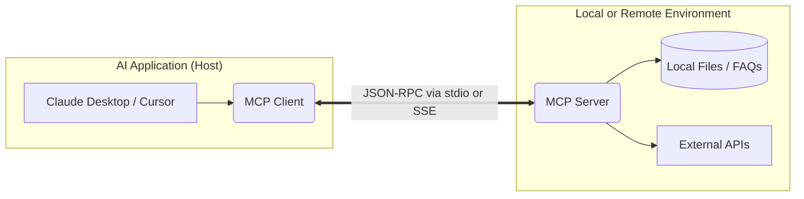

# Lab Manual: Mastering the Model Context Protocol (MCP)

**Course**: Deep Learning and Large Language Models  
**Semester**: 6th Semester Undergraduate  
**Instructor**: Dr. Moazam  

---

## 🎯 Lab Objectives
By the end of this lab, you will be able to:
1. Understand the theoretical foundations of the Model Context Protocol (MCP) and why it solves the $N \times M$ integration problem in AI.
2. Differentiate between the three MCP primitives: **Resources** (app-controlled), **Tools** (model-controlled), and **Prompts** (user-controlled).
3. Develop a functional MCP server using Python and the `FastMCP` framework.
4. Integrate your custom MCP server with an AI client (like Claude Desktop or Cursor).

---

## Part 1: Theoretical Framework

### 1.1 The Integration Problem
In the early days of AI agents, connecting an LLM to external services required custom integrations. Connecting 5 different LLMs (Claude, OpenAI, Gemini, etc.) to 5 different data sources (GitHub, Slack, local files, databases) required $5 \times 5 = 25$ custom API integrations. This is known as the **$N \times M$ integration problem**.

### 1.2 What is MCP?
Introduced by Anthropic, the **Model Context Protocol (MCP)** acts as the "USB-C of AI Agents". It is an open standard that allows developers to write an integration **once**, and any MCP-compatible AI client can immediately use it to access data and perform actions securely. 

### 1.3 Architecture Overview
MCP uses a client-server architecture.



- **Host/Client**: The AI application you interact with (e.g., Claude Code, Cursor).
- **Server**: The software you build to expose specific data and tools to the AI.
- **Transport Layer**: How they communicate. MCP supports **stdio** (standard input/output for local servers) and **SSE** (Server-Sent Events for remote servers).

---

## Part 2: The Three Primitives of MCP

MCP organizes capabilities into three categories. Understanding when to use which is the key to building secure and effective agents.

### 2.1 Resources (The App-Controlled Primitive)
Resources are pre-authorized data that the application exposes. The model **does not** decide what to expose; it simply reads what is available.
*   **Analogy**: File cabinets your application unlocks.
*   **Use Cases**: Reading documents, fetching configuration files, checking logs.
*   **MIME Types**: Resources return data with specific MIME types (e.g., `text/plain`, `application/json`).

### 2.2 Tools (The Model-Controlled Primitive)
Tools are functions the LLM decides to execute based on the user's prompt. They represent actions and can have side effects.
*   **Analogy**: Buttons the agent can press.
*   **Use Cases**: Creating a GitHub issue, sending an email, deleting a file.
*   **Input Schema**: Tools require a strict JSON Schema definition so the LLM knows what arguments to pass.

### 2.3 Prompts (The User-Controlled Primitive)
Prompts are predefined, parameterized templates that users can invoke via slash commands (e.g., `/triage_issue`).
*   **Analogy**: Macros or shortcuts for common tasks.
*   **Use Cases**: Standardizing workflows, providing specialized context automatically.

---

## Part 3: Step-by-Step Lab Execution

### 3.1 Use Case: Building a Smart Academic Assistant

> [!IMPORTANT]
> **The Core Usecase**
> Instead of building a simple chatbot, you are building an **Autonomous Agent**. Your goal in this lab is to create an AI assistant that acts as a personalized tutor for university courses. It will dynamically discover course playlists, pull exact video transcripts, and calculate grades—all without human intervention.

Before writing code, it is crucial to understand the hierarchical flow of the **Agentic Workflow** you are about to build:

1. **Phase 1: Resource Discovery**  
   The LLM first queries your server for available course materials (e.g., official Stanford YouTube playlists) to anchor its context in ground-truth academic data.
2. **Phase 2: Context Retrieval**  
   When a student asks a specific question (e.g., "Summarize lecture 1" or "Generate a quiz"), the LLM dynamically uses a custom **Tool** to fetch the exact video transcript or perform mathematical operations (like calculating a CGPA).
3. **Phase 3: Reasoning & Generation**  
   The LLM combines the newly retrieved context with its foundational knowledge to generate highly accurate, course-specific educational content without hallucinating.

### 3.2 Prerequisites
Before starting the lab, ensure you have the following installed on your machine:
- **Python 3.10** or higher.
- **Node.js & npm** (required to run the MCP Inspector for debugging).
- A modern code editor like **VS Code** or **Cursor**.

### Project Structure
Create a new directory for this lab (e.g., `mcp-academic-lab`). By the end of the lab, your project structure should look like this:

```text
mcp-academic-lab/
├── academic_server.py      # The main Python file containing your MCP server code
└── venv/                   # (Optional) Python virtual environment
```

### Step 1: Environment Setup
Open your terminal, navigate to your newly created project directory, and install the required libraries:

```bash
pip install mcp pydantic
```

Create the `academic_server.py` file in this directory.

### Step 2: Initializing the Server & Adding Resources
Open `academic_server.py` and import `FastMCP`. We will add **Direct Resources** to expose official Stanford course playlists.

```python
from mcp.server.fastmcp import FastMCP
from pydantic import Field
import json

# Initialize the server
mcp = FastMCP("AcademicAssistant")

# Simulated Resource Database
COURSE_PLAYLISTS = {
    "cs224n_nlp": "Stanford CS224N: Natural Language Processing with Deep Learning. URL: https://www.youtube.com/playlist?list=PLoROMvodv4rPwxE0ONYRa_itZFdaKCylL",
    "cs224r_rl": "Stanford CS224R: Deep Reinforcement Learning. URL: https://www.youtube.com/playlist?list=PLoROMvodv4rOCXd21gf0CF4xr35yINeOy"
}

@mcp.resource(
    "course://stanford/playlists", 
    name="Stanford Course Playlists", 
    description="List of available Stanford AI course playlists.", 
    mime_type="application/json"
)
def list_playlists() -> str:
    """Returns the available course playlists."""
    return json.dumps(COURSE_PLAYLISTS)
```

> [!TIP]
> The AI client will read `course://stanford/playlists` to understand what courses are available to the student before taking action.

### Step 3: Adding Tools (CGPA Calculator & Transcript Fetcher)
Now, let's give the LLM the ability to perform actions. We will add two tools: one to calculate a student's CGPA and another to fetch mock transcripts of YouTube lectures.

```python
@mcp.tool(
    name="calculate_cgpa", 
    description="Calculate the CGPA for a student up to their current 6th or 8th semester."
)
def calculate_cgpa(
    semester_gpas: list[float] = Field(description="List of GPAs for each completed semester (e.g., [3.5, 3.8, 3.2, 4.0, 3.6, 3.9])")
) -> str:
    """Calculates the Cumulative GPA given a list of semester GPAs."""
    if not semester_gpas:
        return "Error: No semester GPAs provided."
    
    if len(semester_gpas) > 8:
        return "Error: Maximum of 8 semesters allowed."
        
    cgpa = sum(semester_gpas) / len(semester_gpas)
    return f"Calculated CGPA after {len(semester_gpas)} semesters: {cgpa:.2f}"

@mcp.tool(
    name="get_lecture_transcript", 
    description="Retrieve the text transcript of a specific video lecture using its Video ID."
)
def get_lecture_transcript(
    video_id: str = Field(description="The YouTube Video ID (e.g., DzpHeXVSC5I)")
) -> str:
    """Simulates fetching a transcript for a given video ID."""
    # Simulated transcripts for lab purposes
    transcripts = {
        "DzpHeXVSC5I": "Welcome to CS224N, Lecture 1. Today we will discuss Word Vectors. The core concept is representing words as dense, continuous vectors in a high-dimensional space so that words with similar meanings have similar vector representations. This revolutionized NLP..."
    }
    
    return transcripts.get(video_id, f"Error: Transcript not found for video ID {video_id}.")
```

### Step 4: Adding Prompts (Structured Templates)
The final primitive allows you to provide pre-built, structured prompt templates directly to the user's AI client.

```python
@mcp.prompt(
    name="generate_study_guide",
    description="Creates a customized study guide template for a specific course topic."
)
def generate_study_guide(topic: str) -> str:
    """Provides a structured prompt template for the LLM."""
    return f"Please generate a comprehensive study guide for {topic}. Include key concepts, mathematical formulas (if any), and 3 practice questions."

if __name__ == "__main__":
    # Start the server using stdio transport
    mcp.run()
```

---

## Part 4: Accessing an MCP Client

To interact with your MCP server, you need an MCP-compatible client. We will primarily use **Claude Desktop** as it is 100% free and does not require an API key, but you may optionally use **Cursor**.

### Option A: Claude Desktop (Recommended)
Claude Desktop is a free application that natively supports MCP.
1. **Download**: Go to [claude.ai/download](https://claude.ai/download) and install the application for Windows or Mac. (You must use the desktop app, not the web interface).
2. **Login**: Sign in with your free Anthropic account.
3. **Configure MCP**:
   - Open the configuration file:
     - **Windows**: `%APPDATA%\Claude\claude_desktop_config.json`
     - **Mac**: `~/Library/Application Support/Claude/claude_desktop_config.json`
   - Update the JSON to point to your Python script:

```json
{
  "mcpServers": {
    "academic_assistant": {
      "command": "python",
      "args": [
        "C:/absolute/path/to/your/academic_server.py"
      ]
    }
  }
}
```
4. **Restart Claude Desktop** for the changes to take effect. You should see a small hammer icon 🛠️ in the Claude chat box indicating tools are connected.

### Option B: Cursor (Optional Alternative)
Cursor is a popular AI code editor that offers a freemium model (14-day Pro trial, followed by a basic free tier).
1. Open Cursor and navigate to **Settings > Features > MCP**.
2. Click **+ Add New MCP Server**.
3. Set the type to `command`.
4. Set the name to `academic_assistant` and the command to `python C:/absolute/path/to/your/academic_server.py`.
5. Click **Save** and verify the green light indicates the server is connected.

---

## Part 5: Verification and Laboratory Tasks

### Task 1: Protocol Handshake
Use the MCP Inspector to verify the server is responding correctly to JSON-RPC 2.0 messages. This ensures your code is communicating via the standard MCP protocol before attaching it to an LLM.

```bash
npx @modelcontextprotocol/inspector python academic_server.py
```
* **Observation**: Navigate to the web URL provided in your terminal. Click the "Tools" tab. Verify that `calculate_cgpa` and `get_lecture_transcript` are listed and can be executed manually.

### Task 2: Agentic Reasoning with CS224N
Let's test the assistant's ability to use tools to fetch missing context. Open Claude Desktop and send the following prompt:
> *"Summarize the core concept of Lecture 1 from the Stanford NLP course. Use the video ID: DzpHeXVSC5I."*

* **Expected Behavior**: Claude will automatically realize it needs the transcript. It will call the `get_lecture_transcript` tool, receive the raw text, and use its internal reasoning to provide a concise summary of Word Vectors based *only* on the provided text.

### Task 3: Educational Content Generation (Quiz Generation)
Let's test the assistant's ability to combine Resources and internal reasoning to generate educational materials. Send the following prompt to Claude:
> *"Based on the CS224R Reinforcement Learning course (Playlist in resources), generate a 5-question quiz on Markov Decision Processes (MDPs). Include an answer key."*

* **Expected Behavior**: Claude will first read the `course://stanford/playlists` resource to locate the official CS224R URL to anchor its context. It will then use its foundational knowledge of MDPs to generate a comprehensive, relevant academic quiz for the student.

### Task 4: CGPA Calculation
Send the following prompt to Claude:
> *"I am a 6th-semester student. My GPAs for the first 5 semesters were 3.2, 3.5, 3.8, 3.1, and 3.9. What is my current CGPA?"*

* **Expected Behavior**: Claude will format the GPAs into an array, invoke the `calculate_cgpa` tool, and return the final CGPA.

### Task 5: Testing MCP Prompts
Test the third and final MCP primitive by using the pre-defined prompt template. Click the "Attachment" (paperclip) icon in Claude Desktop, select "Prompts", and choose `generate_study_guide`. Enter "Markov Decision Processes" as the topic and send it.

* **Expected Behavior**: Claude will use the predefined prompt structure exactly as you wrote it in your server to generate a highly structured study guide.

---

## Part 6: Analysis - Security and Scalability

As an AI engineer, building MCP servers requires understanding system constraints and security. For your lab report, write a brief evaluation of the following two concepts:

### 1. Context Window Efficiency
**Concept**: Explain how providing a transcript via a tool is vastly more efficient than pasting it directly into a prompt. 
* *Hint*: Standard tool-use saves up to 98.7% of tokens by allowing the server/tool to process or chunk data locally, passing only the final summary or relevant snippet to the LLM, rather than flooding the LLM with a raw 50,000-token transcript.

### 2. The Confused Deputy Problem
**Concept**: Discuss the security risks of an MCP server having broad access to local files. 
* *Hint*: If a user asks the assistant to "Summarize my grades," the server must only access approved academic folders. If the server lacks strict path validation, a malicious prompt could trick the LLM into reading sensitive system files (e.g., `C:\Windows\System32\config\SAM` or `~/.ssh/id_rsa`). How would you prevent this in your `academic_server.py` code?

---

## Deliverables and Grading Rubric
Your submission must include the following to receive full marks:

| Deliverable | Description | Marks |
| :--- | :--- | :--- |
| **Code Implementation** | Submit your fully commented `academic_server.py` file. All three primitives (Resources, Tools, Prompts) must be implemented correctly. | 40% |
| **Execution Proof** | Submit a PDF report containing screenshots of Claude successfully completing Tasks 2, 3, 4, and 5. Ensure the tool-use UI is visible in the screenshots. | 30% |
| **Security Analysis** | Include well-reasoned written answers for the Context Window Efficiency and Confused Deputy Problem (Part 6). | 30% |
